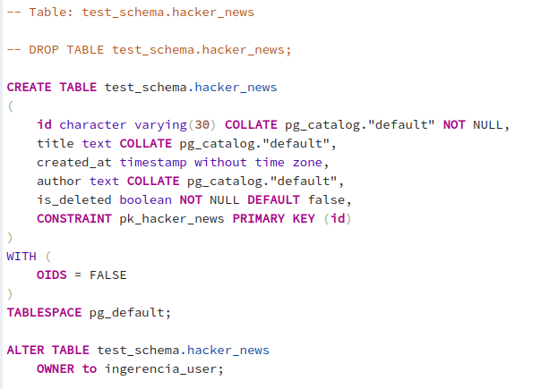

# Iniciando despliegue del Backend

  Autor: Jose G Pacheco (jgp3500@gmail.com)

## Requisitos
* Java 8
* Spring Boot 2.2.4
* Postgres v11.6
* Para poder compilar el proyecto, se debe tener instalado y configurado en el IDE (Eclipse, Netbeans, IntelliJ IDEA) Lombok.

#### Instalacion
* Descargar el proyecto desde github [https://github.com/malcomx/InGerenciaBackEnd]
* Instalar Manejador de base de datos Postgres v10 o en adelante
* Ejecutar el script que se encuentra **~/test/src/main/resources/static/ingerencia_ddl.sql**. El script se basa en ejecucion SQL y debe ser modificado la clave del usuario **postgres** local.
* Dicho script se encarga de crear la tabla hacker_news

